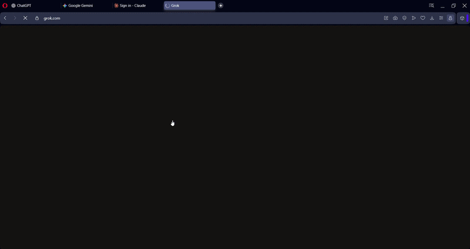

# Code to Chat

> Practice coding before going back to AI.

**Code to Chat** is an open-source browser extension that occasionally interrupts AI chat sites with a full-screen coding challenge.

To continue using the AI site, you need to solve the challenge and pass all tests.

It currently supports:

- ChatGPT
- Claude
- Gemini
- Microsoft Copilot
- Perplexity
- Grok
- DeepSeek
- Poe



## Features

- Full-screen coding challenges on supported AI websites
- JavaScript and Python local execution when available
- C, C++, C#, and Java support through Judge0
- Automatic test validation
- Persistent unsolved challenges
- Random challenge scheduling
- Configurable cooldowns and trigger chances
- VS Code-style syntax highlighting
- Compilation and runtime error feedback
- Copy/paste protection during challenges
- Optional offline Python execution with Pyodide
- Easy-to-add challenges and AI websites
- Free and open source

## Installation

Code to Chat is currently distributed through GitHub and is **not available on browser extension stores**.

### Chrome, Edge, Brave, and Opera

Clone the repository:

```bash
git clone https://github.com/akosimico/code-to-chat.git
```

Or download the repository as a ZIP from GitHub and extract it.

Then:

1. Open your browser's extensions page:

```text
Chrome: chrome://extensions
Edge:   edge://extensions
Brave:  brave://extensions
Opera:  opera://extensions
```

2. Enable **Developer mode**.
3. Click **Load unpacked**.
4. Select the `code-to-chat` folder.
5. Open one of the supported AI websites.

Code to Chat should now be active.

> After updating or reloading the extension, refresh any AI tabs that were already open.

## How It Works

While you're using a supported AI website, Code to Chat can randomly trigger a coding challenge.

When a challenge appears, it covers the AI page with a coding environment.

Write your solution and run the tests.

**Pass every test → AI unlocked.**

If you close the tab or browser without solving the challenge, it remains pending.

The next time you visit any supported AI site, the same challenge comes back immediately.

Solving it in one tab also unlocks your other open AI tabs.

## Supported Languages

| Language | Execution |
| --- | --- |
| JavaScript | Local browser sandbox / Judge0 fallback |
| Python | Pyodide / Judge0 fallback |
| C | Judge0 |
| C++ | Judge0 |
| C# | Judge0 |
| Java | Judge0 |

JavaScript and Python attempt to run locally first.

C, C++, C#, and Java require an internet connection because they are executed through Judge0.

## Offline Python Support

Python can optionally run entirely inside the browser using **Pyodide**.

Download a Pyodide release and copy its files into:

```text
code-to-chat/
└── pyodide/
    ├── pyodide.js
    ├── pyodide.asm.js
    ├── pyodide.asm.wasm
    ├── python_stdlib.zip
    └── pyodide-lock.json
```

Then reload the extension.

If the local Pyodide runner is unavailable, Python automatically falls back to Judge0 when an internet connection is available.

## Judge0

C, C++, C#, and Java are executed using the Judge0 server configured in:

```text
config.js
```

Because these languages are executed remotely:

- Internet access is required.
- Submitted code is sent to the configured Judge0 server.
- Public Judge0 instances may be rate limited.

You can use your own Judge0 instance by changing:

```js
JUDGE0_URL
```

in `config.js`.

Remember to add the new server origin to `host_permissions` in `manifest.json`.

## Challenge Scheduling

Challenge behavior can be configured through the `CFG` object near the top of:

```text
content.js
```

Available settings include:

| Setting | Purpose |
| --- | --- |
| `testMode` | Trigger challenges every visit without cooldown |
| `chanceOnLoad` | Chance of triggering when opening an AI site |
| `chanceOnReturn` | Chance of triggering when returning to an existing tab |
| `loadDelaySec` | Random delay before showing a challenge |
| `recurMin` | Random interval between challenges |
| `graceOptionsMin` | Possible cooldown periods after solving |

For normal use, make sure:

```js
testMode: false
```

When `testMode` is enabled, challenges intentionally appear much more frequently.

## Persistent Challenges

Once a challenge appears, it is recorded as pending.

If you:

- close the tab
- close the browser
- navigate away
- leave without passing the tests

the challenge remains pending.

The same challenge appears again the next time you open a supported AI website.

It is cleared only after all tests pass.

## Editor

The built-in coding editor includes:

- Line numbers
- Syntax highlighting
- Keywords, strings, comments, and numbers
- Function and type highlighting
- Compilation errors
- Runtime errors
- Error-line highlighting

When possible, the line that caused an error is highlighted in red.

JavaScript syntax errors may not always include accurate line information because of browser sandbox limitations.

## Copy & Paste Protection

While a challenge is active, Code to Chat blocks common ways of copying the problem or pasting a solution.

Blocked interactions include:

- `Ctrl/Cmd + C`
- `Ctrl/Cmd + V`
- `Ctrl/Cmd + X`
- `Ctrl + Insert`
- `Shift + Insert`
- `Shift + Delete`
- Right-click context menu
- Drag and drop
- Middle-click paste
- Text selection

This is designed to discourage casual cheating, not provide foolproof anti-cheat protection.

Users can still disable the extension, use OS-level tools, or manually retype content.

## Adding Challenges

Challenges are defined in:

```text
challenges.js
```

Add a new entry to:

```js
CHALLENGES
```

Challenges can contain:

- Function-based tests for JavaScript and Python
- Input/output tests for C, C++, C#, and Java

Challenges are selected randomly while avoiding the immediately previous challenge.

Pull requests adding useful coding challenges are welcome.

## Adding AI Websites

Supported websites are configured in:

```text
manifest.json
```

Add the site's URL pattern to the appropriate `matches` lists.

If you add support for another AI platform, consider opening a pull request so everyone can use it.

## Project Structure

```text
code-to-chat/
├── assets/
│   └── code-to-chat.gif
├── pyodide/             # Optional
├── challenges.js        # Coding challenges
├── config.js            # Judge0 configuration
├── content.js           # Main extension logic
├── manifest.json        # Extension configuration
├── README.md
└── LICENSE
```

## Contributing

Contributions are welcome.

You can contribute by:

- Adding new coding challenges
- Supporting more AI websites
- Fixing bugs
- Improving browser compatibility
- Improving the coding editor
- Improving accessibility
- Adding local language runners
- Improving documentation

Fork the repository or clone it:

```bash
git clone https://github.com/akosimico/code-to-chat.git
cd code-to-chat
```

Create a branch:

```bash
git checkout -b feature/my-change
```

Make your changes, test the extension locally, commit them, and open a pull request.

## Reporting Issues

Found a bug or have an idea?

Open an issue in the GitHub repository and include, when relevant:

- Browser and version
- Affected AI website
- Steps to reproduce
- Expected behavior
- Actual behavior
- Screenshots or recordings

## Privacy

Code to Chat does not need to read your AI conversations to generate coding challenges.

However, code executed using a remote Judge0 server is sent to that server for compilation and execution.

JavaScript and Python can execute locally when their local runners are available.

Because this project is open source, you can review `manifest.json`, `config.js`, and the rest of the source code to see exactly what the extension can access.

## Known Limitations

- Code to Chat locks the webpage, not the browser.
- Users can close tabs or disable the extension.
- Firefox is not currently supported.
- Public Judge0 servers may be rate limited.
- Changes to supported AI websites may occasionally break compatibility.
- The extension is still being tested across different browsers and environments.

If you encounter a problem, please open an issue.

## License

Licensed under the **MIT License**.

See [`LICENSE`](LICENSE) for details.

## Author

Created by **akosimico**.

GitHub: `@akosimico`

---

**Code less with AI. Forget less how to code.**